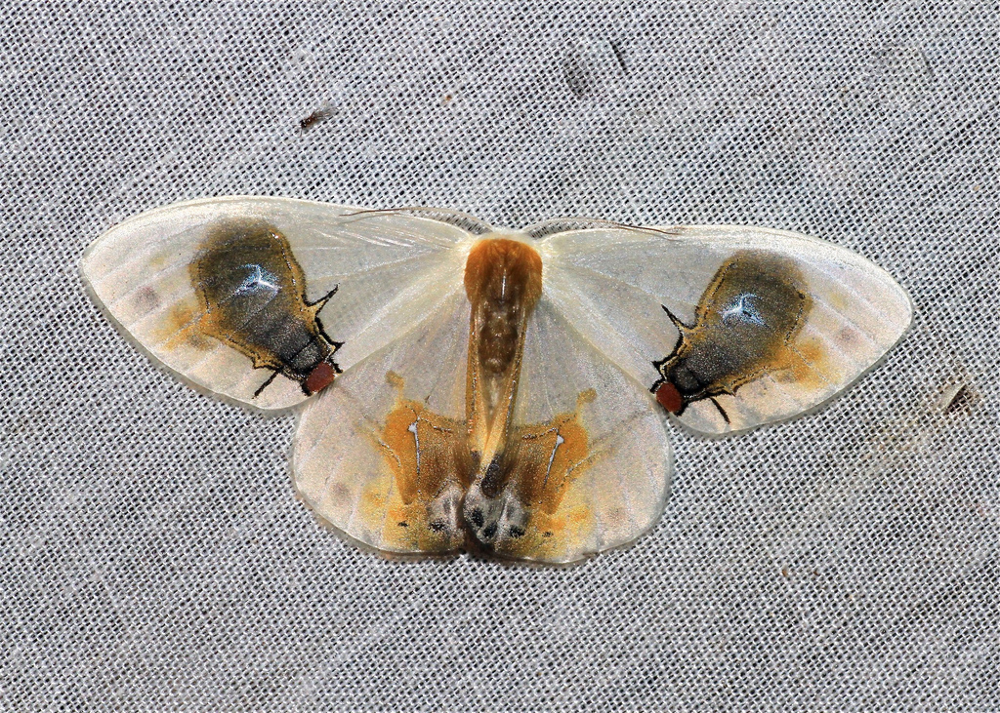
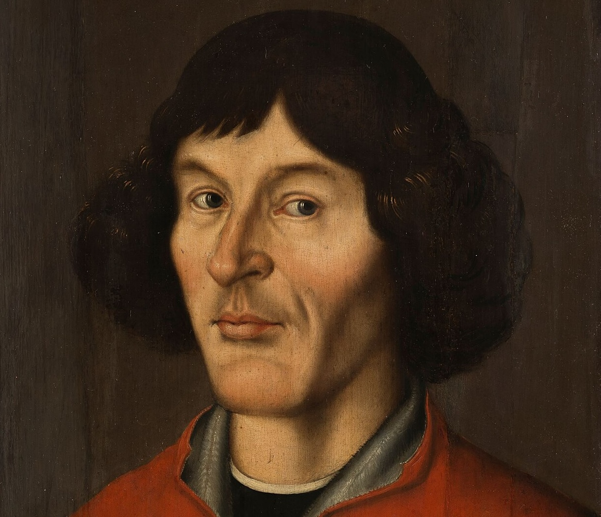
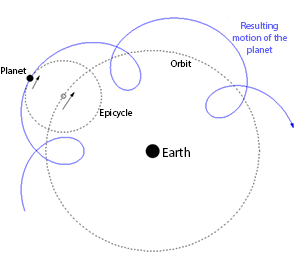
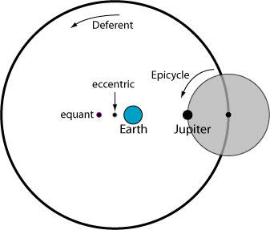
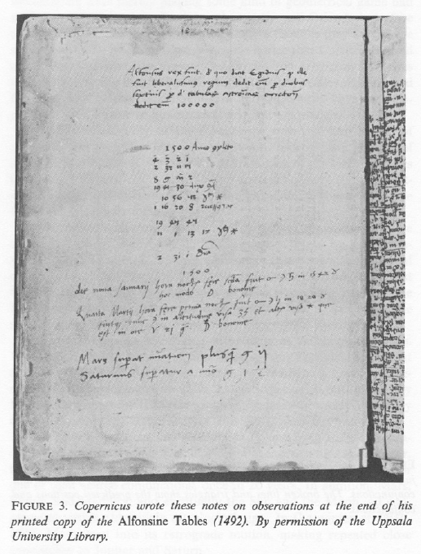
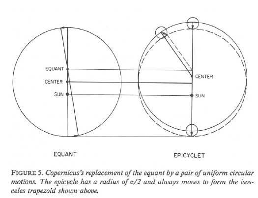
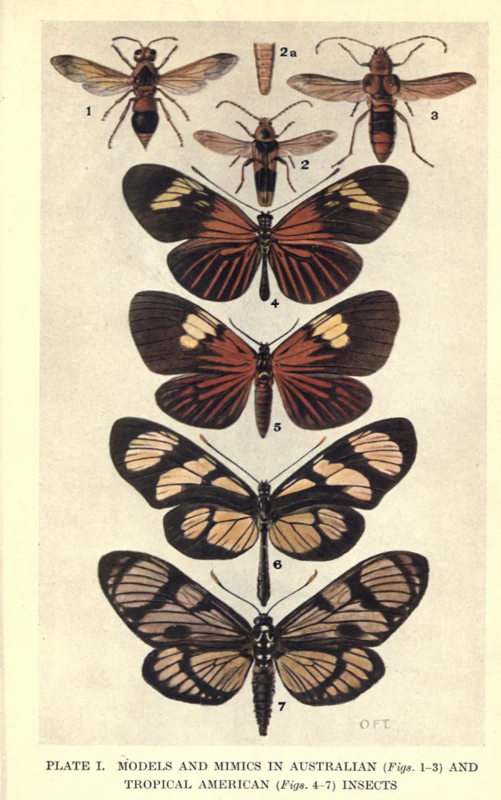
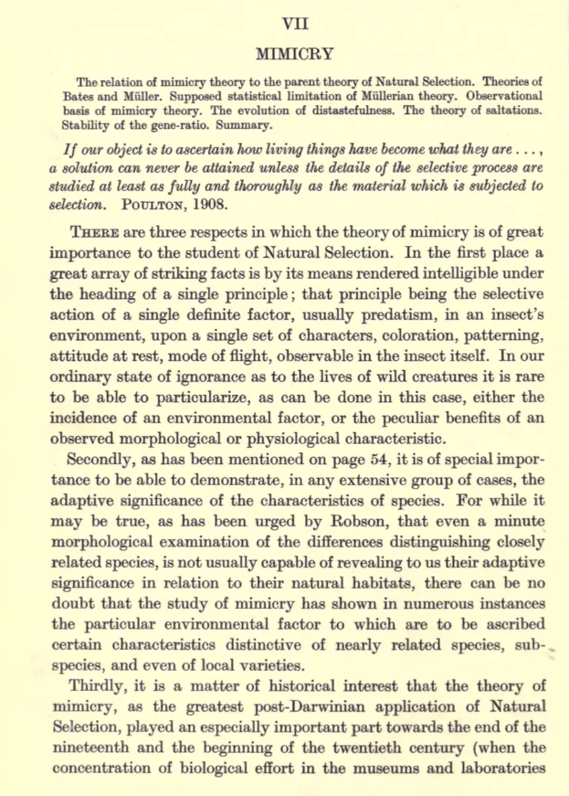

## Copernicus and the moth

The triumph of heliocentrism over geocentrism is often depicted in our history textbooks (well, at least my own high school textbooks) as a linear process: heliocentrism, championed by Copernicus and Bruno, was obviously the correct theory. The only reason truth did not triumph immediately in Copernicus's time was suppression and persecution by the Catholic Church. This standard account of history is not just linear; it is also binary, with good guys such as Copernicus and Bruno on the bright side and the Catholic Church standing in the dark.

This caricature gets at least two things wrong. First, Giordano Bruno should not be portrayed as a simple martyr for the Copernican astronomical system: heliocentrism as an astronomical device was a convenient **working assumption**, not a heresy, and his execution in 1600 cannot be reduced to an argument about the Earth's orbit alone.[^1] Second, geocentrism and heliocentrism were not two simplified diagrams as we see in textbooks, of which only one looked sensible. They were competing ways of making a working universe out of observations, mathematics and a theory of motion.

[^1]: Dilwyn Knox, ['Giordano Bruno'](https://plato.stanford.edu/archives/spr2022/entries/bruno/), *Stanford Encyclopedia of Philosophy*; Alberto A. Martinez, ['Giordano Bruno and the heresy of many worlds'](https://doi.org/10.1080/00033790.2016.1193627), *Annals of Science*. Bruno adopted Copernicanism as part of a much broader cosmology; the surviving trial evidence does not support reducing his condemnation to advocacy of heliocentrism alone.

Thomas Kuhn's now famous account of the Copernican revolution is more interesting because it makes the old astronomers less foolish and the new astronomy more fragile. In 1543, heliocentrism did not arrive as a neat bundle of superior predictions, good physics and decisive observations. Copernicus offered a daring reorganisation of the heavens, but one that was still technically problematic. Resistance to heliocentrism was religious in some settings, but it was also mathematical and physical. There were good reasons for a sixteenth-century astronomer to be sceptical about Copernicus's theory.[^2]

[^2]: Thomas S. Kuhn, *The Copernican Revolution: Planetary Astronomy in the Development of Western Thought*. See also Sheila Rabin, ['Nicolaus Copernicus'](https://plato.stanford.edu/archives/spr2019/entries/copernicus/), *Stanford Encyclopedia of Philosophy*.

I will argue that, in one specific respect, the Copernican revolution, the long process of one new paradigm replacing another, resembles a problem posed by biological mimicry. Mimicry is an extremely intuitive concept: prey animals who merely look like poisonous or unpalatable ones may gain a survival advantage. The moth *Macrocilix maia*, illustrated below, is a spectacular example of deceptive appearance. According to Darwin's theory of evolution by natural selection, mimicry should be the result of accumulating small changes. But how did mimicry start? What possible use is there in being *slightly* like an unpalatable butterfly? In both the Copernican revolution and the evolution of mimicry, the crucial question is: we can all see that the mature outcome works, but how could it survive an apparently unpromising start?

{width="50%"}

{width="50%"}

## Why did the old astronomy work?

From the perspective of a human observer, from one night to the next, most stars preserve their positions relative to one another, rotating across the sky as an apparently fixed background. A small set of brighter bodies, the planets, drift against that background. Most of the time Mars, Jupiter and Saturn travel in one direction through the zodiac. Periodically each seems to slow, stop, reverse direction for a time and then resume its former course. This is **retrograde** motion: Mars for example can be watched to make a loop or zigzag against the stars over successive nights.

In Aristotle's geocentric picture, Earth is still at the centre, with every planet going evenly round it in a single circle. This version of geocentrism does not explain the retrograde motion. Ptolemaic astronomy was more sophisticated. In a typical construction, a planet travelled on a small circle, an **epicycle**, while the centre of that small circle travelled on a larger circle, the **deferent**, positioned around Earth. If the two rotations are chosen appropriately, the planet traces a loop in the sky during part of its journey: retrograde motion is reproduced by geometry.[^3]

[^3]: Rabin, ['Nicolaus Copernicus'](https://plato.stanford.edu/archives/spr2019/entries/copernicus/).

{width="50%"}

There was more to account for than backward loops. Ancient astronomers knew that planets did not travel at a constant speed: they brightened and dimmed and moved faster in some parts of their paths than in others. Ptolemy employed further geometrical adjustments, including an **eccentric** and an **equant**. An eccentric displaced the centre of the deferent, the larger circle, from Earth. The equant was another point from which the centre of the epicycle moves at a constant angular speed.[^4] These mechanisms offend our expectation that the true solar system should be simple. But they did convert observed irregularities into calculable and predictable regularities.

[^4]: Harvard Natural Sciences Lecture Demonstrations, ['Ptolemaic Epicycle Machine'](https://sciencedemonstrations.fas.harvard.edu/presentations/ptolemaic-epicycle-machine).

{width="50%"}

An epicycle was a flexible mathematical technique. A geocentric cosmos is false, but a mathematical system framed around it could still be highly useful in practice. By the sixteenth century Copernicus was challenging not a naive picture of planets on concentric hoops, but a long-developed technical practice capable of accurate predictions.[^5]

[^5]: Kuhn, *Copernican Revolution*; compare Rabin, ['Nicolaus Copernicus'](https://plato.stanford.edu/archives/spr2019/entries/copernicus/), secs. 2.3 and 2.6.

A nice example comes from Copernicus himself. He owned a copy of the *Alfonsine Tables*, a set of astronomical tables calculated in the Ptolemaic tradition. During an unusual gathering of Mars, Jupiter and Saturn in 1503–1504, Copernicus wrote in his copy that Mars was more than two degrees ahead of the tabular prediction, while Saturn lagged by one and a half degrees. Owen Gingerich's modern reconstruction of the same astronomical event found that Jupiter had been predicted rather accurately. Moreover, a two-degree error is about four times the apparent width of the full Moon: visually detectable and inadequate for later high-precision astronomy, but still good enough to locate the planet in the correct patch of sky. More importantly, these errors are *correctable* by changing the parameters of a Ptolemaic system (and Copernicus would know that); they were not, by themselves, a reason to dismantle geocentrism.[^6]

[^6]: Owen Gingerich, ['The Astronomy and Cosmology of Copernicus'](https://www.as.utexas.edu/astronomy/education/spring05/bromm/readings/copernicus.pdf).

{width="50%"}

## Did heliocentrism work better?

In heliocentrism, Earth ceased to be the still platform from which all celestial motion was measured. It rotated daily and travelled yearly around the Sun. The Moon continued to orbit Earth, while Mercury and Venus occupied orbits inside Earth's orbit and Mars, Jupiter and Saturn travelled outside it. In this rearrangement, retrograde motion acquires a more natural explanation: Mars does not really reverse its orbit. This reorganisation also did something the Ptolemaic arrangement could not do in the same unified way: it connected the observed periods of the planets with their ordering and relative distances from the Sun. Venus is never seen far from the Sun because its orbit lies inside Earth's; Mars undergoes opposition and apparent retrogression in the relation expected of an outer planet. Copernicus could present the heavens as an interconnected arrangement more elegantly than Ptolemy could.[^7]

[^7]: ['Nicolaus Copernicus'](https://plato.stanford.edu/archives/spr2019/entries/copernicus/), sec. 2.3.

But this was not Kepler's astronomy: Copernicus remained committed to celestial movements compounded out of uniform circles and did not accept that planets might move in ellipses. He therefore had to retain **epicycles** and **eccentrics** to fit astronomical observations. He also retained the old Aristotelian idea that Earth must be the centre of gravity of the universe, even though it's no longer at the centre in heliocentrism. Both Kuhn's and Gingerich's judgement is that, as a predictive system, **Copernicus's was neither more accurate nor simpler than Ptolemy's**.[^8]

[^8]: Kuhn, *Copernican Revolution*; see also Rabin, ['Nicolaus Copernicus'](https://plato.stanford.edu/archives/spr2019/entries/copernicus/), secs. 2.3 and 2.6.

{width="50%"}

Of course, this does not mean that Ptolemy was superior. It means that the evidence for a true framework can initially arrive burdened with unresolved problems. Heliocentrism took a long time to become securely established: Copernicus would still need the later support of Kepler's ellipses, telescopic observations and Newtonian mechanics.[^11]

[^11]: Rabin, ['Nicolaus Copernicus'](https://plato.stanford.edu/archives/spr2019/entries/copernicus/), sec. 2.6.

Moreover, Copernicus was not a modern secular empiricist born too early; in many ways he was not ahead of his time. One of his central complaints against Ptolemaic practice concerned the equant. The equant accounted for observed non-uniformity only by measuring uniform motion from a point other than the centre of a planet's circle. To Copernicus, that was ugly. A new system should not merely calculate; it should disclose an orderly arrangement whose motions were genuinely compounded from uniform circles.[^12]

[^12]: Rabin, ['Nicolaus Copernicus'](https://plato.stanford.edu/archives/spr2019/entries/copernicus/), sec. 2.3.

His Sun-centred paradigm offered just this sort of correction: planetary distances, periods and retrogressions became parts of one schema. Copernicus was not eliminating metaphysics from astronomy; he was replacing one physical and philosophical picture of celestial order with another.[^13] Towards the conclusion of his *On Revolutions*, he said, we have now accounted for the planetary motions by using just **34** circles. Job beautifually done.

[^13]: Rabin, ['Nicolaus Copernicus'](https://plato.stanford.edu/archives/spr2019/entries/copernicus/), sec. 2.2.

## Can there be a butterfly that is only a little deceptive?

Now to biology. Natural selection does not perfect a species towards a planned endpoint. It changes the frequency of heritable variants when, in a particular environment, individuals bearing one variant on average survive or reproduce better than individuals bearing another. Predators are therefore powerful agents of selection: if a bird tastes an insect that is toxic or intensely unpleasant, a conspicuous colour pattern can become a warning. Birds are remarkably good learners: they learn the association between insects' appearance and their taste.

In **Batesian mimicry**, a palatable or relatively undefended prey species, the **mimic**, resembles a defended or distasteful species, the **model**. The mimic benefits if a predator mistakes it for the model. Mimicry works only because the warning signal already carries information about the model; if edible mimics became overwhelmingly common, attacking individuals with the warning pattern would again be profitable for the predator. Mimicry is thus not just resemblance: it is essentially game theory. It is a relationship among appearance, predator behaviour, the abundance of model and mimic and the costs of attacking each.[^14]

[^14]: Thomas N. Sherratt, ['The evolution of imperfect mimicry'](https://doi.org/10.1093/beheco/13.6.821), *Behavioral Ecology*.

An accurate mimic obviously enjoys a selective advantage. A predator may avoid an almost exact copy of a distasteful butterfly, but why should it avoid one bearing only a spot, a stripe or a crude approximation? That question created a difficulty for Darwinians. By the early twentieth century, biologists who accepted evolution still disagreed sharply about its mechanism. William Bateson and R. C. Punnett emphasised discontinuous mutations, or saltations, rather than the accumulation of minute changes defended by biometricians such as Karl Pearson. Some butterfly mimics occur in sharply distinct forms rather than as a smooth series of graded resemblances. Punnett took such polymorphic mimics to support the idea that mimicry had appeared by large mutations: a new form arriving more or less already equipped to imitate its model rather than being assembled by minute improvements.

R. A. Fisher treated the problem of mimicry as central, not peripheral, to evolutionary biology: he included mimics and their models as the only colour illustrations in his seminal work *The Genetical Theory of Natural Selection* (1930). In the mimicry chapter of that book, he responded to Punnett's saltationism. Fisher accepted that the major factors distinguishing the female forms of *Papilio polytes* might have arisen abruptly. What he rejected was the inference that a single mutation had generated the finished mimetic pattern. Drawing on experiments with hooded rats, he argued that a Mendelian factor could act as a *switch* between alternative forms while selection on modifier genes progressively refined the colour and pattern expressed in each form. The absence of intermediate morphs therefore did not prove that resemblance had appeared fully formed in a single leap. His argument did not, however, entirely remove the ecological problem of how the first barely mimetic form gained an advantage.[^15]

[^15]: R. A. Fisher, *The Genetical Theory of Natural Selection* (1930), ch. VII, 'Mimicry'; digitised copy at the [Biodiversity Heritage Library](https://www.biodiversitylibrary.org/item/69976).

A partial resemblance helps only under particular conditions: predators must generalise, hesitate or learn imperfectly; models and mimics must occur in relevant frequencies and places; and the resemblance must reduce attacks enough to matter. Later theoretical work on imperfect Batesian mimicry makes the same point formally: the return on ever-closer resemblance can be nonlinear, depending on the cost of attacking the model, the profitability and rarity of the mimic and the available alternative models.[^16]

[^16]: Thomas N. Sherratt, ['The evolution of imperfect mimicry'](https://doi.org/10.1093/beheco/13.6.821), *Behavioral Ecology* (2002).

Fisher's answer is appealing because it does not ask selection to see the final butterfly in advance. It asks only whether some present variant leaves more descendants in its present environment. Suppose one heritable switch produces two recognisably different female colour forms. A modifying variant that makes the mimetic form slightly less likely to be attacked may spread, even if the original switch produced no perfect mimicry. A stable colour-pattern difference can thus become the starting point for additional modifiers to accumulate. This is a genetics of incremental improvement built around discrete variation, not a promise that every intermediate must work in every ecological setting.

E. B. Ford, Fisher's close colleague and intellectual ally, later developed the study of mimicry within the program of ecological genetics, which Ford helped found. Along with other ecological geneticists, he used the idea of a **supergene** to account for how coordinated alternative forms could be inherited together in systems such as *Papilio dardanus*.[^17]

[^17]: E. B. Ford, *Ecological Genetics*, 3rd ed. (1971), ch. 12, 'Mimicry' and ch. 13, '*Papilio dardanus* and the Evolution of Mimicry'.

The question of imprefect mimicry was not solved completely: why they exist remains an active area of research.

## Mimicry and scientific revolution

In the second half of the nineteenth century, it became fashionable for informed citizens to talk about almost everything through the lens of evolution. This was not solely because of Darwin; Robert Chambers, for example, had greatly contributed to the popularisation of evolutionary ideas. Here we position ourselves in that tradition by looking at the Copernican revolution through the lens of evolution, and in particular mimicry. In both cases, hindsight tempts us to judge a humble beginning by the polished achievement that came later.

There were good rational reasons for a sixteenth-century astronomer to remain loyal to geocentrism and Ptolemaic machinery. In fact, as Gingerich observed, Copernicus' contemporaries admired the fact that he got rid of equant: they could be a 'Copernican' by favouring a model without equants, without committing to heliocentrism. After all, it was common in Copernicus' time to view astronomy as a 'geometric game': whatever arrangement of planets the astronomer assumes, it's just for the convenience of calculation. Copernicus was venerated as this smart astronomer who could predict planetary motions *equally* well without using the philosophically unsatisfactory equant. People could not have foreseen the vast superiority of heliocentrism after Tycho Brahe's observations and Kepler's new theory.

Punnett's objection to gradual mimicry had a similar force. Once we see a convincing mimetic butterfly, it is easy to say that natural selection must have built the resemblance little by little. But Punnett insisted that the first little step was exactly what needed explanation. The sharply separated female forms of *Papilio polytes* made the objection more pointed: to Punnett, they suggested a new mimetic type arriving in a discontinuous jump, not a spectrum of useful intermediates.

Fisher's reply was not that every slight resemblance must be valuable. He instead that a major Mendelian factor could establish a new colour pattern; once that pattern had gained some utility in encounters with predators, selection on other modifying factors could refine it. The polished mimic observed today would therefore not be evidence that the whole pattern sprang into existence at once. Yet Fisher's answer retained a condition: the early form must be sufficiently recognisable, in the ecology and perceptual world of its predators, for improvement by mimicry selection to begin at all.

Our textbooks tend to explain scientific revolutions as how Punnett explains mimicry: the new theory appears already equipped with the successful form it will later possess. Scientific revolutions are often remembered only in their grown-up form. Hindsight supplies Copernicus with Kepler and Newton; it supplies the earliest mimic with the final beauty of a model's wing pattern. The useful lesson here is that a successful new framework can begin as a technically vulnerable possibility. The beginning of a good idea may not look triumphant. It may look, for quite respectable reasons, a little dumb.
