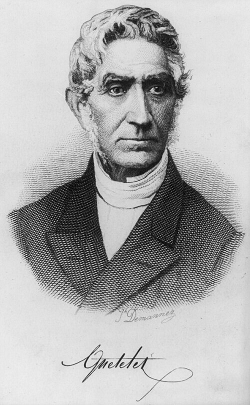
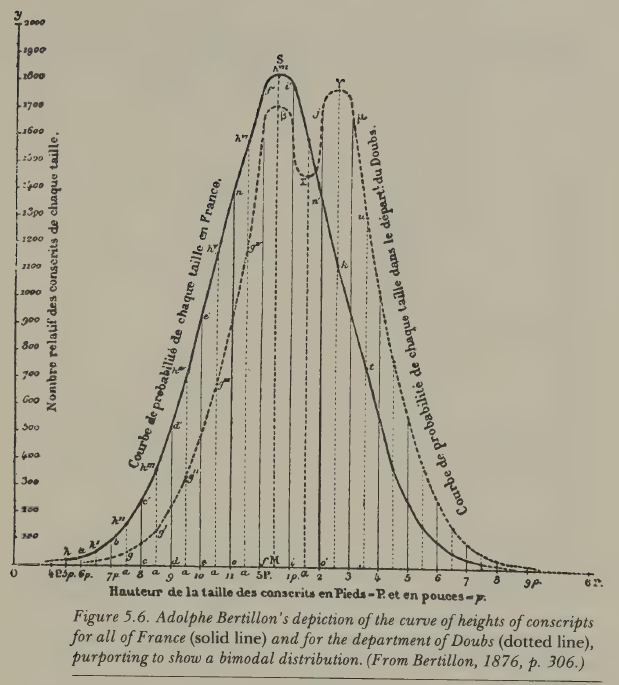
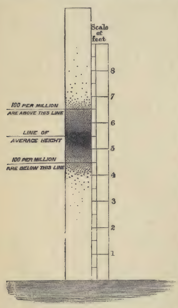
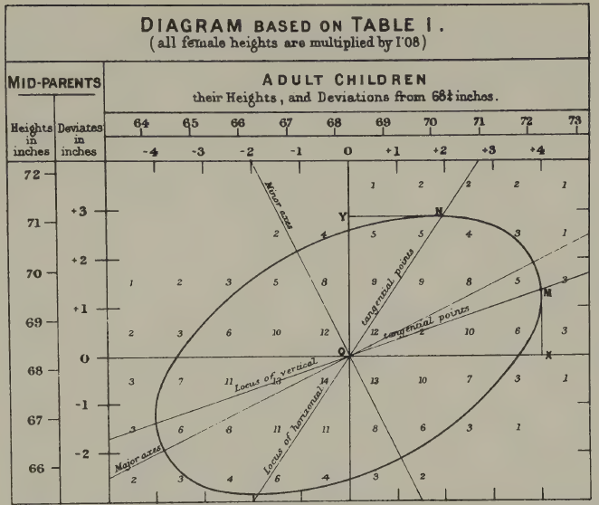
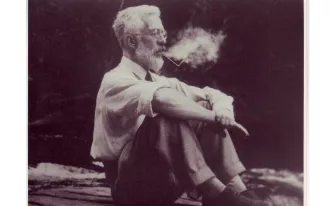
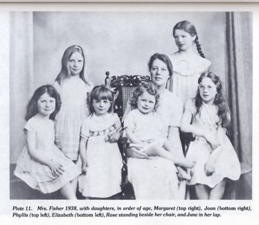
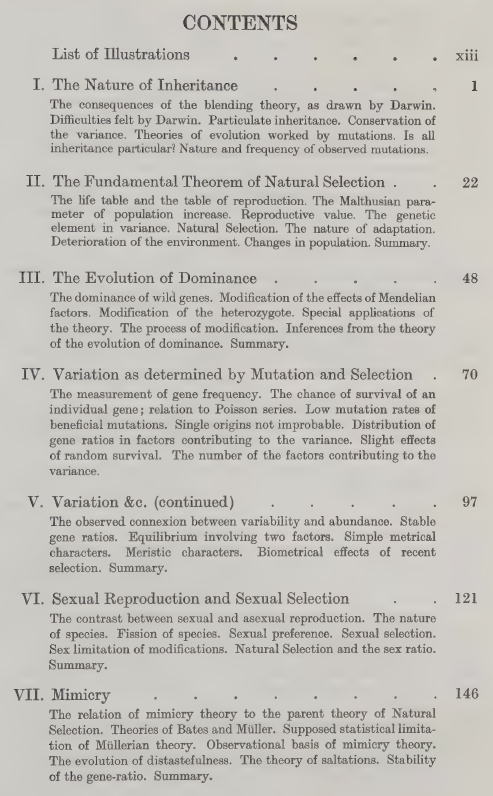
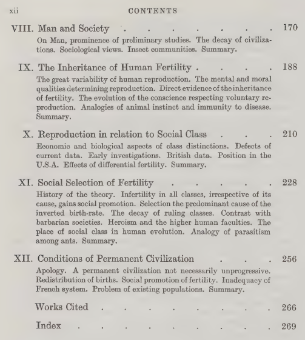
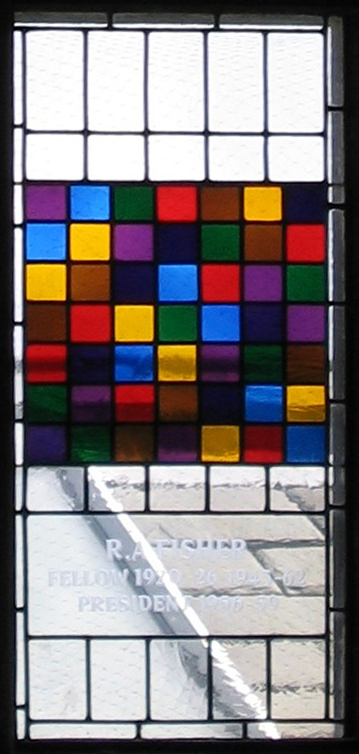

---

This article is based on a talk I recently gave to colleagues at Melbourne Integrative Genomics. If you have any comments and suggestions,
feel free to contact Jiadong Mao, <jiadong.mao@unimelb.edu.au>. 

---

Statisticians use regression, correlation, the normal distribution and analysis of variance routinely. 
They are the bread and butter of modern quantitative science. 
For a long time I approached these tools the way perhaps most of us do: as mathematical abstractions that emerged from the internal logic of probability theory. 
Regression is a natural consequence of the bivariate normal. Maximum likelihood is an optimisation principle. 
Variance decomposition is linear algebra. The origin stories we tell in textbooks are clean and self-contained.

More recently I started reading about the history of three disciplines that my work involves: statistics, genetics and biology.
What I found was a profound entanglement, between the early development of statistics, the early development of human genetics and the ideology of eugenics. 
Not a peripheral connection or an embarrassing footnote, but something closer to a co-development: 
many of the foundational tools of statistics were invented *in order to* make eugenic arguments scientifically credible.

This essay is based on a talk I gave recently at Melbourne Integrative Genomics (MIG) to my colleagues. 
The title poses two questions. 
The first, *how statistical is eugenics?*, has a relatively straightforward answer: very. 
The history of eugenics was built on statistical tools and reasoning from the start. 
The second, *how eugenic is statistics?*, is harder, and I do not pretend to have a definitive answer. 
But I think it is worth thinking through.

## What is eugenics?

Eugenics, a term coined by Francis Galton in the 1880s (from the Greek meaning "well-born"), 
refers to the idea that the human species can and should be improved through selective breeding. 
In its historical forms, this meant encouraging reproduction among those deemed biologically "superior" (positive eugenics) 
and discouraging or preventing reproduction among those deemed "inferior" (negative eugenics). 
The movement attracted support from across the political spectrum, left, right and centre, and was not confined to any single country, 
though it found its most horrifying expression in Nazi Germany's racial policies.

What makes eugenics particularly relevant as a case study for responsible science is not just the obvious moral catastrophes 
it produced, but the way it illustrates how ideological assumptions can become embedded within apparently neutral scientific machinery. 
The statistical tools themselves are not contaminated. But the story of how they came into being is more complicated than our textbooks suggest.

## The age of numbers

To understand why statistics and eugenics became entangled, we need some sense of what was happening in the nineteenth century regarding the veneration of quantitative science. 
Across Europe, quantification was becoming a 'technology of trust', to borrow a phrase from Theodore Porter's *Trust in Numbers*. 
Bureaus of statistics and statistical societies were being established everywhere. 
Numbers were replacing speculation and subjective judgment as the currency of credible knowledge, in science, in governance in the administration of populations.

A key figure in this story is the Belgian astronomer Adolphe Quetelet.

Quetelet took the normal (Gaussian) distribution, which Gauss had used to describe measurement error in astronomy, and applied it to human populations. 
He fitted normal curves to physical traits like chest circumference and height, but also to what he called moral qualities: 
rates of drunkenness, insanity, suicide and crime. He called this program *physique sociale* — social physics — and out of it he derived the concept of *l'homme moyen*, 
the 'average man'. In Quetelet's framework, the person who possessed all the average qualities of a population represented the ideal: the average was the best.

This is a strange idea by modern standards, and even in Quetelet's own time it had critics. 
One contemporary pointed out that the average of several right triangles need not itself be a right triangle — the arithmetic mean of a constrained set can fall outside the set. 
And the statistician Francis Ysidro Edgeworth would later dub Quetelet's overenthusiastic application of the normal distribution 'Queteletismus': 
the false doctrine that wherever there is a curve with a single peak, the curve must be Gaussian.

But what interests me most about Quetelet is a particular kind of fallacy that recurs throughout this history. 
When he examined the heights of French conscripts from a particular region and found a bimodal distribution, he concluded, and another scientist confirmed, 
that there must be two distinct racial types in that region (the Celts and the Burgundians). 
It was later shown by the Italian statistician Livi that the bimodality disappeared in later years; 
it had been an artefact of converting rounded centimetre measurements to rounded inches, 
which introduced a systematic rounding error. The two 'races', though once plausible, turned out to be an illusion.

The episode is minor in itself, but the underlying pattern, i.e. fitting a statistical model to data, then treating the model's features as revelations about nature,
is one that reappears again and again in the eugenic program. 
Simply because the data are well described by a model does not mean the model reveals something fundamental. 
This seems obvious stated plainly, yet the temptation to make that leap proved remarkably persistent among some very capable quantitative thinkers.

## Galton: normality as a knife

The historian Ian Hacking observed that the concept of the 'normal' evolved into two 
distinct meanings during the nineteenth century. In Quetelet's hands, the normal was 
the right and good — the average as ideal. But Francis Galton, who came later, inverted 
this entirely. For Galton, the average was the *mediocre*, and the point of studying
the normal distribution was to identify the tails, i.e. to classify people into grades and find the exceptional.

Galton is one of those figures who is impossible to discuss without acknowledging 
the scale of his intellectual contributions alongside the purposes to which he 
directed them. He was Charles Darwin's half-cousin (they shared a grandfather, 
Erasmus Darwin), and like Darwin he was trained in the naturalist tradition, 
travelling extensively in Africa. But from 1865 onward, the dominant theme of his research was heredity.

His first major work in this area was *Hereditary Genius* (1869). In the book's 
opening, Galton states his program plainly: he proposes to show that a man's natural 
abilities are derived by inheritance under the same limitations as the physical features 
of the whole organic world. And crucially, he means this to apply not just to height or 
eye colour, but to what he calls 'moral qualities': talent, eminence, character. 
Throughout his work, you can see an almost reflexive equation: whatever he discovers 
about the inheritance of physical traits, he immediately extends to morality and 
intellect, because he sees no fundamental difference between them.

To quantify eminence, Galton needed a standard. He rejected social rank, since being a duke or a general did not suffice, 
and instead turned to biographical dictionaries. He calculated that roughly 1 in 4,000 of the male population 
of England was listed in a particular reference work, and he adopted this as his working proportion. 
He then divided the normal distribution into 14 classes (seven below and seven above the average, 
with a special class X for the most exceptional) and used these quantiles to categorise the population. 
In Galton's hands, the normal distribution had become a knife for cutting a population into slices.

To validate this scheme, Galton examined the Cambridge Mathematical Tripos, famously one of the most difficult examinations in England,
and noted that even among the very best students, the range of marks was enormous: the highest scorers achieved over 7,000 marks, 
while the lowest passing candidates scored around 300. The variation was real and dramatic.

Having defined eminence, Galton set about showing that it ran in families. He developed 
a genealogical method, mapping the kinship structure of eminent men and counting how 
many of their relatives were also eminent. Among 286 judges over roughly 200 years, 
more than 100 had one or more eminent relatives, a far higher proportion than the general population. 
Moreover, the proportion of eminent relatives declined with the degree of kinship: 
36 per cent of sons were eminent, but only about 4.5 per cent of uncles.

Now, one thing that surprised me when I read *Hereditary Genius* was that Galton 
actually considered the obvious confounders. He did not naively ignore the role 
of socioeconomic advantage. His argument, however, was that the effect of social 
position was not strong enough to override natural ability. He made three subsidiary 
arguments. First, men of high ability can overcome social obstacles. Second, 
in countries like America with fewer class barriers, you see more educated people 
overall but no more truly eminent individuals, suggesting education raises the 
average but does not create the exceptional. Third, the 'Pope's adopted sons' 
argument: men given enormous social advantages (like being adopted by a Pope) 
often fail to achieve lasting distinction, because they lack the natural gifts.

These arguments are wrong, or at best radically incomplete. They ignore the structural 
effects of poverty on nutrition, health, and cognitive development in ways that 
would take another century to properly understand. But they are not stupid. 
Galton was aware of what we would call confounding, and he dismissed it through 
reasoned (if flawed) argument, not through ignorance. This makes the errors more 
interesting, and in some ways more instructive, than simple naivety would be.

## The invention of regression

Perhaps the most consequential of Galton's contributions arose from a puzzle about 
the normal distribution itself. If traits are inherited, and every person generates a 
lineage of descendants, then the variance of traits in a population should grow with 
each generation. That is, each lineage contributing its own spread. But this does 
not happen. The distribution of human height appears to stabilise across generations. Why?

Galton investigated this by tabulating the heights of over 900 parent-child pairs, 
using the average of the father's and mother's heights (which he called the 'mid-parent'). 
He was not a strong mathematician, so he did what he's best at: visualise and work things out via intuition. 
When he connected equal-frequency contours on his cross-tabulation, he found concentric 
ellipses. These ellipses are we would now recognise as the contours of a bivariate normal distribution. He noticed that the 
major and minor axes of these ellipses gave him two regression lines, and crucially, 
the slopes were less than one. Tall parents tended to have tall children, but not *as* tall. 
The children regressed toward the population mean.

This is what he called 'regression'. And it solved his puzzle. Because each generation's 
offspring regress toward the mean, the variance does not explode. The normal distribution 
is self-stabilising. Karl Pearson, Galton's mentee, later took Galton's data and formalised the mathematics, 
developing the correlation coefficient and much of the theory of linear regression.

The point to take away is this: regression, correlation, and their associated mathematical 
apparatus did not emerge from abstract probability theory. They were invented to answer 
questions about human heredity. The motivating problem was eugenic: Galton wanted 
to understand the inheritance of human qualities in order to improve the human stock. 
The tools he built for that purpose turned out to be extraordinarily general and useful, 
but their genesis was specific and ideological.

And Galton, characteristically, overgeneralised his own findings. Having found a 
regression slope of roughly two-thirds for height, he became convinced that this 
same coefficient must hold for all traits, e.g. exam marks, artistic ability, moral character. 
He claimed to have confirmed it in additional domains, but his evidence was often thin, 
and the universality he claimed was a kind of statistical mysticism: the belief that 
a particular numerical regularity, once discovered, must reflect a law of nature.

## Fisher: Galton with better mathematics

R.A. Fisher is a harder case, and in many ways a more troubling one.

If you work in statistics or genetics, you almost certainly know Fisher's name. 
He has been called the founder of modern statistics and the greatest biologist since Darwin 
(by none other than Richard Dawkins, the most famous evolutionary biologist of our time). 
He developed analysis of variance, the theory of maximum likelihood, the exact test for 2×2 tables, 
the concept of sufficiency, the design of experiments, and much else. 
His 1918 paper and later monograph founded the modern discipline of population genetics and contributed to 
modern synthesis, i.e. the reconciliation of Mendelian genetics with Darwin's natural selection. 
The mathematical machinery he introduced for decomposing variation into different 
components has underpinned research into the genetics of complex traits for over a century.

What is less widely known outside specialist circles is the extent to which 
eugenics motivated Fisher's scientific work.

A few biographical details help set the scene. Fisher had severe myopia from childhood, 
which meant he could not do mathematics with pen and paper in the normal way. His 
daughter and biographer, Joan Fisher Box, reported that he learned to visualise mathematics 
in his head. This is one reason his published papers are notoriously difficult to follow: 
they read like transcriptions of geometric intuitions rather than step-by-step derivations. 
He was also, by the testimony of his contemporaries, a 'practicing eugenicist' — one colleague, 
C.P. Stock, said Fisher was 'the only man I knew to practice eugenics'. Fisher 
fathered eight children (two sons, six daughters), at considerable financial 
hardship, because he believed it was his eugenic duty to reproduce prolifically. 
In his own words: 'We, eugenists, do not dub ourselves knights of a new order, 
but we are the agents of a new phase of evolution'.

Fisher's central work on eugenics is *The Genetical Theory of Natural Selection* (1930), 
which is also the book that founded population genetics. If you look at the table of contents, 
there is a perfect division. The first seven chapters, on inheritance, the fundamental 
theorem of natural selection, dominance, mutation, sexual selection, mimicry, are 
brilliant mathematical biology, still read and cited today. The final five chapters, on 
man and society, human fertility, reproduction in relation to social class, and the conditions of permanent civilisation, 
are eugenics, and until recently they were politely ignored or treated as an embarrassing appendix to an otherwise great book.

*Table of contents of* The Genetical Theory of Natural Selection *(1930). The first seven chapters are mathematical biology, still read and cited today; the final five, on 'man and society', are eugenics.*

Here is where it gets interesting. The standard account, maintained for decades by 
Fisher's students and admirers, was that the book was written in sequence: the population 
genetics first, the human material as a set of 'deductions' added at the end. 
Fisher himself encouraged this reading, insisting in his preface that the human chapters 
were 'strictly inseparable' from the general theory. But the historian Alex Aylward, 
drawing on a previously unstudied 1919 draft manuscript in the Fisher Papers at the 
University of Adelaide, has recently shown that the book was in fact written *backwards*. 
Fisher composed the eugenics chapters first — nearly a decade before the rest of the book — as 
a standalone work on civilisational decline. The population genetics came later, built around and 
in service of the eugenic programme that Fisher had been developing since his undergraduate days at Cambridge, 
where he was a founding member of the university's Eugenics Society.

The 'deductions respecting Man', it turns out, long preceded their purported theoretical foundation. *The Genetical Theory* was, as Aylward puts it, a backwards book.

## The argument Fisher built

What did Fisher actually argue in these later chapters? And why do I find it more troubling than Galton?

Fisher began with demographic data. He observed that birth rates were inversely related 
to social class: in early twentieth-century France, the upper and middle classes averaged around 1.6 
children per family, while unskilled workers averaged around 4. This was not speculation; 
it was census data. And Fisher, unlike Galton, was not content to leave the analysis at the descriptive level.
He tested whether the variation in family size could be explained by a Poisson process. That is, whether the 
differences were just random fluctuation. If births followed a Poisson distribution, the variance 
should equal the mean (about 6.19). The observed variance was 60, roughly ten times larger. Something systematic was going on.

Fisher then calculated what he called the 'selection intensity' on human fertility. 
In animal populations, the typical selection intensity on a favourable trait is around 
0.01 per generation, a very gentle pressure. Fisher calculated that the selection 
intensity on human reproductive tendency was approximately 0.9, 
nearly a hundred times stronger. If fertility was heritable (and Fisher marshalled evidence that it was, 
showing correlations between the family sizes of parents and offspring that halved predictably 
with each generation, consistent with genetic inheritance), then this enormously powerful 
selection pressure meant that the tendency to have fewer children was being bred out of the population with astonishing speed.

But here was the problem, as Fisher saw it. The classes who were reproducing 
least, i.e. the professional and educated middle classes, were, in his view, 
the most eugenically valuable. (Fisher's contempt was directed not at the poor but 
at the hereditary aristocracy, whom he regarded as idle inheritors; the true 
pillar of civilisation, for Fisher, was the professional class, lawyers, doctors, professors.) 
If these valuable classes failed to reproduce, their positions would be filled through upward 
social mobility from below, and this would, Fisher believed, dilute the quality of 
the ruling class. He saw this as the mechanism behind the fall of civilisations 
throughout history: a relentless dysgenic pressure built into the structure of any stratified society.

His proposed solution was income-proportional family allowances. Every family 
with children should receive a payment, but the amount should be proportional 
to the parents' earnings. The idea was to remove the economic penalty for 
having children at every level of the social scale, but particularly for the 
professional classes. If you read the proposal without its eugenic context, 
it sounds merely regressive: paying the rich more for having babies. Once you understand 
the framework, it is clearly a eugenic intervention designed to boost reproduction among those Fisher considered genetically superior.

## Why Fisher is the harder case

With Galton, it is relatively easy to draw a line between the statistical innovations and the eugenic 
ideology. Galton's science is visually and intuitively brilliant but mathematically crude. 
There are large, visible gaps between his data and his conclusions. You can admire his 
invention of the scatter plot and the regression line while recognising that his claims about the inheritance of 'eminence' rest on a house of cards.

With Fisher, this separation is much harder. You need a working knowledge of statistics 
and genetics to follow his arguments, and once you do follow them, they are not easily 
dismissed on purely technical grounds. The demographic data were real. The overdispersion 
relative to a Poisson model was real. The correlations between parental and offspring 
fertility were real. The mathematical framework Fisher built was genuinely sophisticated 
and in many cases technically sound. The problems lie not in the arithmetic but in 
the assumptions: in the equation of social class with genetic worth, in the treatment of 
fertility as a heritable trait without adequately distinguishing genetic from cultural 
transmission, in the leap from a demographic observation to a civilisational theory.

This, I think, is precisely what makes Fisher a more important case study than 
Galton for thinking about responsible science. Mathematical sophistication can make 
ideological assumptions *harder to see*, not easier. When the reasoning is crude, 
the ideology is visible; when the reasoning is rigorous, the ideology can hide inside the machinery.

## An incomplete origin story

In 2020, Gonville and Caius College, Cambridge, where Fisher had been a Fellow and 
President, removed a stained-glass window commemorating Fisher and his contributions to 
experimental design. The window had been proposed by Fisher's student Anthony Edwards, 
himself a distinguished statistician. Students campaigned for its removal on the grounds 
that the college should not continue to celebrate a eugenicist. The decision was 
controversial, and people I respect disagree about whether it was the right call.

I do not think I have a confident view on the question of memorialisation. 
Whether we should name things after Fisher, or take his name off them. 
These are questions about *heritage*: what a community chooses to honour. They 
are distinct from questions about *history*: what actually happened, 
and what it means. Both matter, but they operate by different rules.

What I do think is that when we teach statistics, the origin story matters. 
The tools themselves, regression, correlation, analysis of variance, maximum likelihood, 
are not contaminated by their origins. They are mathematically sound and enormously useful, 
and they would be just as valid if they had been invented by someone with no interest in 
human breeding. But they were not. They were developed by people who were thinking about 
human heredity, human classification, and human improvement, and in many cases they were 
developed *specifically for* those purposes.

To teach these tools as if they emerged from pure mathematical abstraction, 
as natural consequences of probability theory, as if someone simply sat down with the 
bivariate normal and noticed you could derive regression from it, is historically false. 
And I think the historical truth matters, not because it changes the mathematics, but 
because it illustrates something that remains relevant: the way that ideological 
assumptions can be embedded within technically sound scientific apparatus, becoming invisible precisely because the machinery works.

This is not a problem confined to the nineteenth century. Anyone who works with 
statistical models of complex human traits, in genomics, in psychology, in education, 
in criminal justice, faces versions of the same challenge. The models work; the predictions 
are often accurate; the mathematics is correct. The question is always what assumptions are 
doing the work, and whether the transition from description to prescription is justified by 
the evidence or smuggled in by the framework.

Knowing the history will not, by itself, prevent us from making similar mistakes. 
But not knowing it makes it easier to imagine that we already have.

---

*Further reading: Alex Aylward, "R.A. Fisher, eugenics, and the campaign for family allowances in interwar Britain" (British Journal for the History of Science, 2021); Alex Aylward, "A backwards book? Eugenics and the evolution of R.A. Fisher's The Genetical Theory of Natural Selection" (Notes and Records, 2025); Walter Bodmer et al., "The outstanding scientist, R.A. Fisher: his views on eugenics and race" (Heredity, 2021); Theodore Porter, Trust in Numbers (1995); Ian Hacking, The Taming of Chance (1990).*

