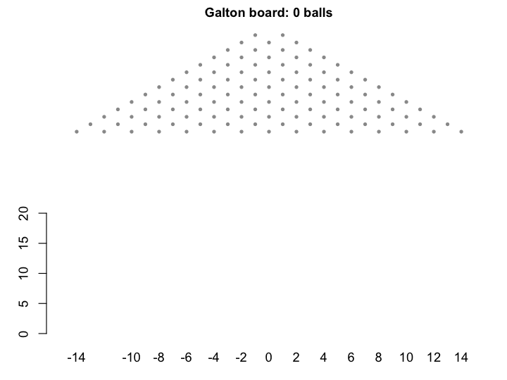
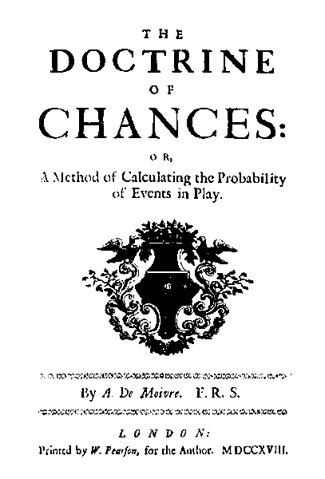
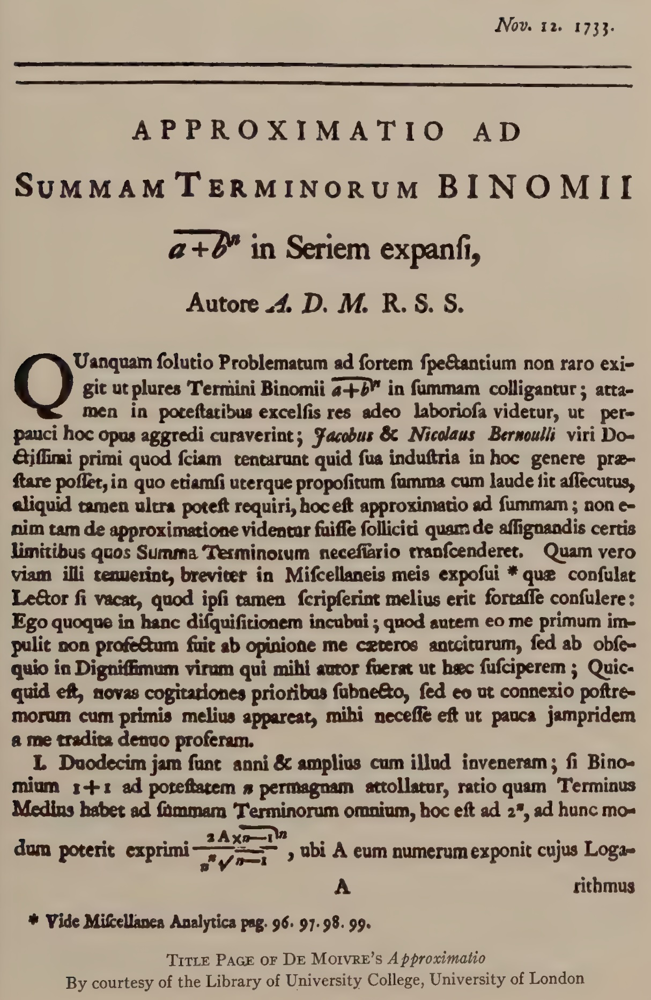
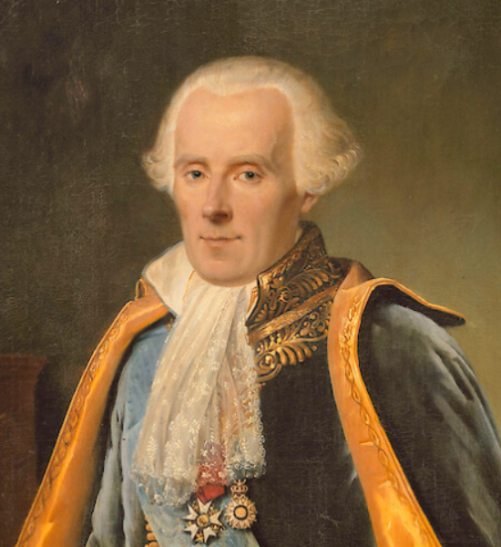
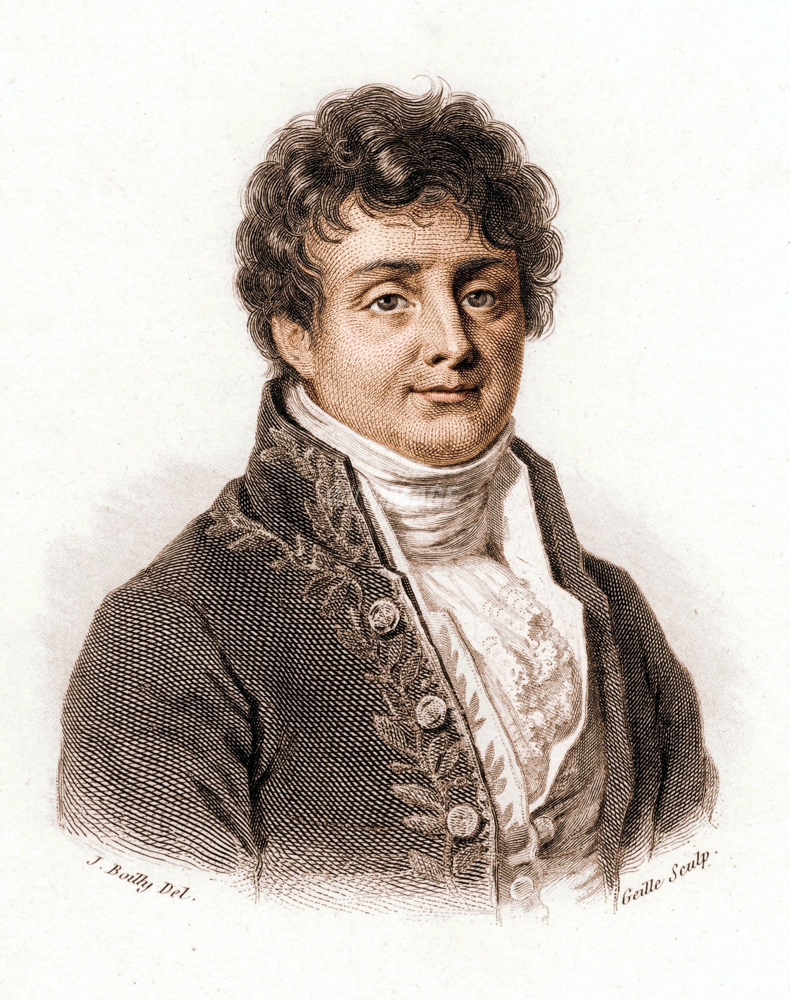
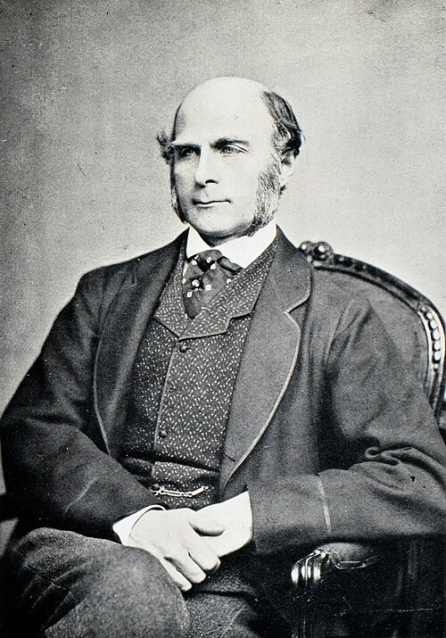

```{r setup, include=FALSE}
knitr::opts_chunk$set(echo = FALSE, warning = FALSE, message = FALSE,
                      fig.width = 8, fig.height = 5, dpi = 150)
```

---

This essay is based on a guest lecture I gave to Year 1 biomedicine students in *Mathematics & Statistics for Biomedicine* at the University of Melbourne.

Parts of it are from my earlier talk on statistics and eugenics.

I walked into the wrong room and gave 5-min lectures on statistics and ideology to a class of Complex Analysis students. Perhaps because it was an interesting topic, they didn't really interrupt me, until I realised that another lecturer was waiting outside the lecture room.

I used Claude Opus 4.6 to support the making of this blog post (yes 4.6 is still many people's favourite model despite the newer 4.7 and 4.8). You can see that from the elevated frequency of en dashes even though I've removed some. We don't use em dashes in this part of the world.

---

## A curve you already know

If you have taken an introductory statistics course, you have met the bell curve. You perhaps know it through the Central Limit Theorem: the sum of many small, independent effects is approximately normally distributed, regardless of the shape of the individual effects. The curve is bell-shaped, symmetric, and completely described by two parameters — the mean $\mu$ and the standard deviation $\sigma$.

```{r}
#| label: fig-normal-density
#| fig-cap: "The standard normal density."
#| fig-width: 7
#| fig-height: 4
op <- par(mar = c(4, 4, 1, 1))
curve(dnorm(x), from = -4, to = 4, lwd = 3, col = "#222222",
      xlab = "x", ylab = "density", n = 401)
abline(v = 0, lty = 3, col = "grey60")
par(op)
```

Here asks two questions about that curve. First: where did it come from? Second: where did the adjective *normal* come from? They turn out not to be the same story. The curve was born in the mathematics of gambling. The word *normal* arrived later, when the curve was applied to people — their bodies, their behaviour, their supposed worth. The mathematical history and the moral history are braided together.

A good place to start is the Galton board (quincunx). A ball drops through rows of pins. At each pin it goes left or right with equal probability. After $n$ rows, its position is the sum of $n$ binary outcomes — exactly the setting of the Central Limit Theorem. Watch many balls pile up, and the bins fill in a bell shape. This is the binomial distribution $(1/2 + 1/2)^n$ becoming normal.

::: {layout-ncol=2}
{width=45%}

{width=75%}
:::

The Galton board is a physical model of the CLT. But as we shall see, Galton's interest in the normal curve was not purely mathematical.


## Born at the gaming table

Probability as a mathematical discipline was born at the gaming table. In the seventeenth century, Cardano, Pascal, and Fermat worked out the mathematics of dice and card games. Huygens published the first printed treatise on probability in 1657. Jacques Bernoulli, Montmort, and Abraham De Moivre followed.

::: {layout-ncol=2}
{width=45%}

{width=45%}
:::

De Moivre (1667–1754) is the central figure here. A French Huguenot (i.e. a protestant living in Catholic France), he fled to London after the revocation of the Edict of Nantes and spent his career as a private tutor and consultant, earning his living by solving gambling problems for wealthy clients. His *Doctrine of Chances* (1718) was, in effect, a gambler's manual.

Many gambling questions reduce to repeated yes/no trials. Ten dice rolls — how many sixes? Twenty coin flips — how many heads? The probabilities come from the binomial expansion:

$$(p + q)^n = \sum_{k=0}^{n} \binom{n}{k} p^k q^{\,n-k}$$

where term $k$ gives the probability of exactly $k$ successes. For small $n$ this is easy enough. But for large $n$, the factorials in $\binom{n}{k} = \frac{n!}{k!(n-k)!}$ become intractable — even though the *shape* of the bar chart stabilises into a familiar bell.

```{r}
#| label: fig-binomial-panels
#| fig-cap: "Binomial probabilities converge to a bell as $n$ grows."
#| fig-width: 10
#| fig-height: 3.5
op <- par(mfrow = c(1, 3), mar = c(4, 4, 2, 1))
for (n in c(5, 20, 100)) {
  k <- 0:n
  barplot(dbinom(k, n, 0.5), names.arg = k, col = "#4477aa",
          border = NA, main = paste0("n = ", n),
          xlab = "k successes", ylab = "P(X = k)")
}
par(op)
```

On 12 November 1733, De Moivre circulated a seven-page Latin pamphlet, *Approximatio ad Summam Terminorum Binomii*, in his own words 'communicated to some Friends, but never yet made public'. Only two copies are known to survive, thanks to Karl Pearson's later rediscovery. The pamphlet contained the first formula for the normal curve: a smooth approximation to those intractable binomial terms.

{width=35% fig-align="center"}

As the historian Helen Walker observed, the treatise was 'supposed by its author to have no practical implications outside the realm of games of chance'. De Moivre saw the normal curve as a computational shortcut for gamblers, nothing more.


## How $\pi$ got into the bell curve

De Moivre's approximation required computing factorials of large numbers. He found that

$$n! \;\approx\; n^{\,n+1/2}\, e^{-n}\, B$$

but could only determine the constant $B$ numerically. It was his colleague James Stirling who worked out the answer. In De Moivre's own words, 'my worthy Friend Mr. James Stirling … found that the Quantity $B$ denote the Square-root of the Circumference of a Circle whose Radius is Unity' — that is, $B = \sqrt{2\pi}$.

This gives what we now call **Stirling's formula**: $n! \approx \sqrt{2\pi n}\,(n/e)^n$. Applied to the three factorials in each binomial term, it produces

$$\binom{n}{k} p^k q^{\,n-k} \;\approx\; \frac{1}{\sqrt{2\pi npq}}\; \exp\!\left(-\frac{(k - np)^2}{2npq}\right)$$

which is the normal density with mean $\mu = np$ and variance $\sigma^2 = npq$. That is how $\pi$ ended up inside the bell curve. It entered through the back door of factorial approximation.

```{r}
#| label: fig-binomial-normal-overlay
#| fig-cap: "Binomial bars ($n = 50$, $p = 0.5$) with the normal approximation overlaid."
#| fig-width: 7
#| fig-height: 4
n <- 50; p <- 0.5
k <- 0:n
op <- par(mar = c(4, 4, 1, 1))
barplot(dbinom(k, n, p), names.arg = k, col = "#4477aa88", border = NA,
        xlab = "k successes", ylab = "probability",
        space = 0, xlim = c(0, n + 1))
x_seq <- seq(0, n, length.out = 400)
lines(x_seq + 0.5, dnorm(x_seq, n * p, sqrt(n * p * (1 - p))),
      lwd = 3, col = "#cc3311")
legend("topright", legend = c("Binomial", "Normal approximation"),
       fill = c("#4477aa88", NA), border = c(NA, NA),
       lwd = c(NA, 3), col = c(NA, "#cc3311"), bty = "n")
par(op)
```


## The unexpected entry of God into the scene

De Moivre did not stop at computation. In the third edition of *The Doctrine of Chances* (1738), he added a theological coda:

> 'Although Chance produces irregularities, still the Odds will be infinitely great, that in process of Time, those Irregularities will bear no proportion to the recurrency of that Order which naturally results from Original Design'.

The normal law, for De Moivre, was not just a mathematical convenience. It was evidence of divine order — the regularity that emerges from many random events was proof of an 'Original Design' behind the universe. Statistics became natural theology.

Karl Pearson, looking back nearly two centuries later, put it sharply. The causes that led De Moivre to his *Approximatio*, Pearson wrote, 'were more theological and sociological than purely mathematical … post-Newtonian English mathematicians were more influenced by Newton's theology than by his mathematics'. Pearson thinks the natural theology interpretation of science was really encouraged by none other than Sir Issac Newton himself.

Whether or not Pearson's diagnosis is fair, my point stands: the normal curve was never a neutral piece of mathematics, even in the hands of its discoverer. De Moivre may have wanted to transcend the gambling tables that paid his bills, and theology was the most elevated discourse available to him. But the instinct to read moral or metaphysical meaning into a mathematical pattern was present from the very beginning.


## From error theory to human traits: Quetelet and the 'average man'

For roughly a century after De Moivre, the normal curve lived in two domains: the mathematics of gambling and the astronomy of measurement error. Astronomers like Gauss and Laplace used it to handle the fact that repeated observations of the same star's position never quite agreed: the errors scattered symmetrically around the true value, piling up near zero, thinning out in the tails. The curve described how imperfect instruments deviated from a fixed truth.

Then Adolphe Quetelet (1796–1874) made the move that changed everything: he took the curve out of the observatory and applied it to people.

::: {layout-ncol=3}
{width=90%}

{width=90%}

{width=90%}
:::

Quetelet was a Belgian astronomer who had studied under Laplace and Fourier in Paris in 1823, learning error theory from the people who had built it. He then directed the Brussels Observatory. But his ambitions extended far beyond the stars. He wanted to create a *physique sociale*, a social physics, that would bring the same mathematical precision to the study of human populations that astronomy had brought to celestial mechanics.

In his 1835 treatise *Sur l'homme et le développement de ses facultés*, Quetelet proposed the concept of *l'homme moyen* — the 'average man'. He collected data on heights, chest sizes, birth rates, and marriage rates, fitted normal curves to them, and declared that the mean of a population represented its ideal. Deviations from the mean were 'errors of nature', analogous to the observational errors that astronomers corrected for.

Quetelet did not stop at heights and chest sizes. He also fitted normal curves to what he called 'moral qualities': rates of crime, suicide, marriage, drunkenness, and insanity. And in the regularity of these rates, he found something both fascinating and disturbing.

> 'We might enumerate in advance how many individuals will stain their hands in the blood of their fellows, how many will be forgers, how many will be poisoners … There is a budget which we pay with a frightful regularity; it is that of prisons, chains and the scaffold'.
>
> — Quetelet, *Recherches sur le penchant au crime aux différens âges* (1831)

The way Quetelet formulates homicide rates sounds quite against free will. This earned Quetelet the label of *materialist* from some of his contemporaries.


### Quetelismus: normalising everything

Quetelet and his followers assumed that any homogeneous population would produce a normal distribution. When the data did not fit into a single normal curve, they inferred that there were yet-to-identify subpopulations.

The most revealing episode involved French military conscripts. Adolphe Bertillon examined the heights of conscripts from the Doubs region in 1876 and found a bimodal distribution, i.e. two peaks instead of one. His conclusion: there must be two distinct racial types in Doubs (which he conjectured to be the Celts and the Burgundians). But twenty years later, the Italian statistician Ridolfo Livi showed that the bimodality vanished in later years. It turns out that Bertillon had converted measurements from rounded centimetres to rounded inches, and the systematic rounding error had created two artificial peaks. The two 'races' were a unit-conversion artefact.

{width=55% fig-align="center"}

The statistician Francis Ysidro Edgeworth later coined the term **Quetelismus** for this fallacy: the false doctrine that wherever there is a single-peaked curve, the curve must be Gaussian. The episode is minor in itself, but the underlying pattern recurs throughout hisotyr: fitting a statistical model to data, then treating the model's features as revelations about nature. Simply because the data are well described by a model does not mean the model reveals something fundamental. This seems obvious when stated like this, yet the temptation to make that leap proved remarkably persistent among some very capable thinkers.


## Galton: from the mean to the tails

Francis Galton (1822–1911) was Charles Darwin's half-cousin, a polymath, explorer, and meteorologist. He coined the word *eugenics* (from the Greek for 'well-born') in 1883 and founded the Galton Laboratory at University College London.

{width=30% fig-align="center"}

Galton encountered Quetelet's work in the 1860s and took from it the idea that the normal curve could be applied to human variation. But he inverted Quetelet's emphasis completely. Quetelet had celebrated the mean; Galton was interested in the **deviation**. For Galton, the average was the *mediocre*, and the point of studying the normal distribution was to identify the tails: to classify people into grades and find the exceptional.

In *Hereditary Genius* (1869), Galton assumed that 'natural ability', an unobservable composite of talent and drive, was normally distributed across the English male population. He divided this assumed distribution into 14 classes: *a* through *g* below the median, *A* through *G* above it, plus *X* for the most exceptional. 'Eminence' was defined as roughly the top 1 in 4,000 men.

The normal curve had become a ranking machine, a language for 'above' and 'below'. The upper tail — 'eminent', 'gifted', 'fit' — was to be encouraged to breed (positive eugenics). The lower tail — 'feeble-minded', 'defective', 'unfit' — was to be *discouraged or prevented* from breeding (negative eugenics).

Galton was explicit about the moral dimensions of the mathematics. In *Natural Inheritance* (1889), he wrote:

> 'mathematicians laboured at the Law of Error for one set of purposes, and we are entering into the fruits of their labours for another'.

And echoing Quetelet's faith in quantification:

> 'Until the phenomena of any branch of knowledge have been submitted to measurement and number it cannot assume the dignity of a science'.

```{r}
#| label: fig-political-tails
#| fig-cap: "The same curve, two political tails. The upper and lower extremes acquire policy meaning in Galton's eugenic framework."
#| fig-width: 8
#| fig-height: 4.5
op <- par(mar = c(4, 4, 1, 1))
curve(dnorm(x), from = -4, to = 4, lwd = 3, col = "#222222", n = 401,
      xlab = "x (standardised 'ability')", ylab = "density")
xs_lo <- seq(-4, qnorm(0.10), length.out = 100)
polygon(c(xs_lo, rev(xs_lo)), c(dnorm(xs_lo), rep(0, length(xs_lo))),
        col = "#cc3311aa", border = NA)
xs_hi <- seq(qnorm(0.90), 4, length.out = 100)
polygon(c(xs_hi, rev(xs_hi)), c(dnorm(xs_hi), rep(0, length(xs_hi))),
        col = "#117733aa", border = NA)
text(-2.8, 0.05, "'unfit'\n→ discourage", col = "#882211", cex = 1.0, font = 2)
text( 2.8, 0.05, "'eminent'\n→ encourage", col = "#0a5a2a", cex = 1.0, font = 2)
par(op)
```

The mathematics is the same as in any introductory statistics course. The context of its use is not.


## Modern echo: the lobster professor

The ideologisation of statistics is not confined to 18th and 19th centuries. It reappears in contemporary public discourse.

In a 2018 essay titled *The Gender Scandal*, the clinical psychologist Jordan Peterson made the following argument:

> 'Many choices are made at the extreme, and not the average. … If you draw a random man and a random woman from the population, and you bet that the woman is more aggressive/less agreeable, you'd be correct about 40% of the time. But if you walked into a roomful of people everyone of whom had been selected to be the most aggressive person out of a 100 almost every one of them would be male'.

The argument has three steps:

1. Two distributions (men and women on some trait like aggression) have a **small mean shift**.
2. They **overlap heavily** — any randomly chosen man and woman are nearly as likely to be on either side.
3. But at the **tails**, the small shift is amplified: among the most extreme 1%, almost all are from one group.

```{r}
#| label: fig-peterson-tails
#| fig-cap: "Two distributions with a small mean shift. The overlap is large, but the right tail is dominated by one group."
#| fig-width: 8
#| fig-height: 4.5
op <- par(mar = c(4, 4, 1, 1))
mu_w <- -0.18; mu_m <- 0.18
curve(dnorm(x, mean = mu_w, sd = 1), from = -4.5, to = 4.5, lwd = 3,
      col = "#cc3311", n = 401,
      xlab = "aggression (standardised)", ylab = "density", ylim = c(0, 0.45))
curve(dnorm(x, mean = mu_m, sd = 1), add = TRUE, lwd = 3, col = "#1166aa", n = 401)
xs_hi <- seq(2.2, 4.5, length.out = 200)
polygon(c(xs_hi, rev(xs_hi)),
        c(dnorm(xs_hi, mu_m, 1), rep(0, length(xs_hi))),
        col = "#1166aa66", border = NA)
polygon(c(xs_hi, rev(xs_hi)),
        c(dnorm(xs_hi, mu_w, 1), rep(0, length(xs_hi))),
        col = "#cc331166", border = NA)
abline(v = 2.2, lty = 3, col = "grey40")
text(3.2, 0.05, "top ~1%\n(prison? CEOs?)", cex = 0.9, col = "grey20")
legend("topleft", legend = c("women", "men"),
       col = c("#cc3311", "#1166aa"), lwd = 3, bty = "n")
par(op)
```

The statistical observation is correct: tail probabilities are sensitive to mean shifts in a way that central probabilities are not. But Peterson does not stop at the statistical observation. In the same essay, his reasoning proceeds in four steps:

1. **Statistical claim about tails**: even small mean differences produce large asymmetries in the extremes.
2. **Empirical generalisation** (citing a 2018 *Science* paper): 'the more egalitarian and wealthier the country, the larger the differences between men and women in temperament and in interest'.
3. **Causal claim**: biology, not socialisation: 'the doctrine … that sex differences are only socially constructed is wrong. Get it? Wrong'.
4. **Policy conclusion**: 'political doctrines that promote equality of opportunity also drive inequality of outcome'. The specific target was Justin Trudeau's 2015 decision to appoint a 50%-female cabinet.

In a 2018 Channel 4 interview with Cathy Newman, Peterson said:

> 'The average IQ for a woman and the average IQ for a man is identical. There is some debate about the flatness of the distribution …'.

'The flatness of the distribution'. That is, the claim that one group has a wider spread, producing more individuals in both tails, is very Galtonian language. It is the same framework: a normal distribution applied to a human trait, with the tails carrying the argumentative weight.

The move from 'the data can be described by two overlapping normal curves' to 'therefore this policy is wrong' requires assumptions at every step, about what the distributions represent, about why they differ, about whether the difference is biological or social, about what follows for policy. 


## Is statistics ideology-free?

The mathematics of the normal curve is abstract and generalisable. The same density function $e^{-x^2/2}$ describes measurement error in a telescope, the outcomes of coin flips, the distribution of heights, and the spread of exam marks. The formulas do not change. The Central Limit Theorem does not care what the 'small independent effects' are specifically.

The word *normal* implies what's usual and ideal — the *ought*. The mean can be the ideal (Quetelet's *l'homme moyen*) or the mediocre (Galton's inversion). The tails can be a neutral mathematical fact or a political program. Assumptions, categories, and uses go hand in hand with the tool.

The curve that De Moivre invented to approximate gambling odds, that Quetelet applied to crime and suicide, that Galton turned into a eugenic ranking machine, and that Peterson deploys to argue against gender-equality policy — it is the same mathematical object throughout. The formulas maybe harmless. But *normal* is never a morally neutral word when applied to people.

---

*Further reading: Helen M. Walker, Studies in the History of Statistical Method (1929); Ian Hacking, The Taming of Chance (1990); Theodore Porter, The Rise of Statistical Thinking (1986); Stephen Stigler, The History of Statistics (1986); Jordan Peterson, 'The Gender Scandal: Part One (Scandinavia) and Part Two (Canada)' ([jordanbpeterson.com](https://www.jordanbpeterson.com/political-correctness/the-gender-scandal-part-one-scandinavia-and-part-two-canada/), 2018).*
