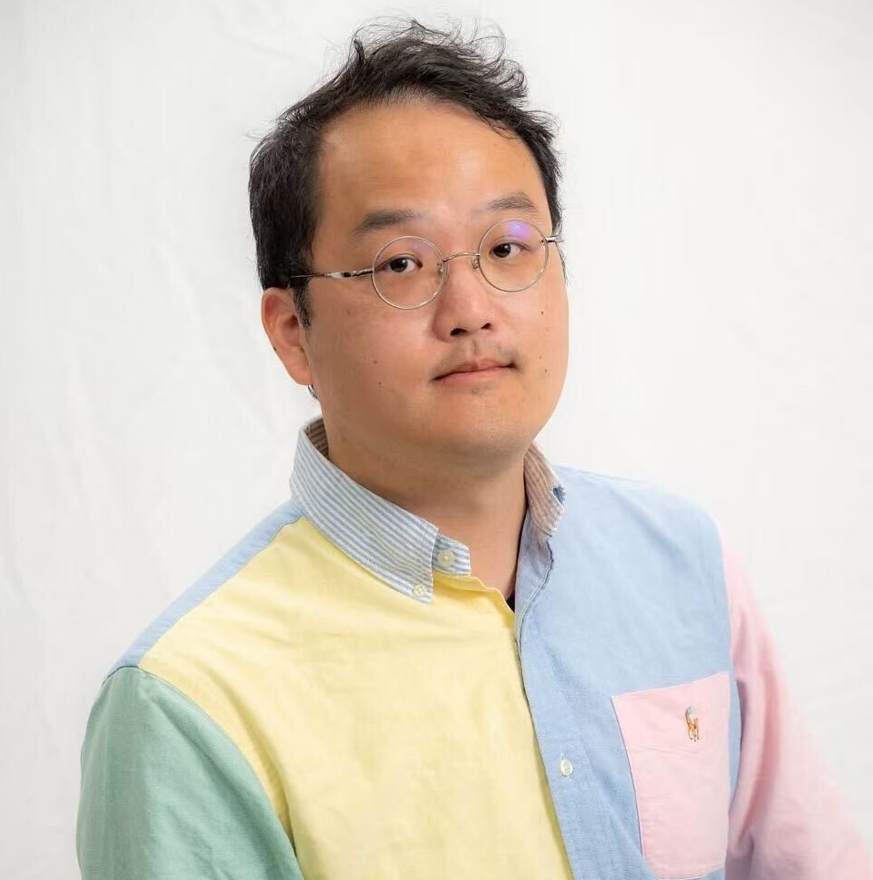

We are building a group for statistically careful, biologically engaged, and collaborative biomedical data science.

## Current Members

::: {.person}
{fig-alt="Jiadong Mao" .person-photo}

### Jiadong Mao

Jiadong is a statistician working on biomedical problems using statistics and machine learning. At Melbourne Integrative Genomics (MIG), the University of Melbourne, he develops computational tools for analysing large and complex 'omics data from biomedical research.

Curiosity is his top value. He enjoys learning biology from scientists and clinicians, and helping them make sense of their data in return.

[GitHub](https://github.com/jiadongm) | [BlueSky](https://bsky.app/profile/jiadongm.bsky.social) | [Email](mailto:chiatungmao@gmail.com)
:::

## Students and Researchers

Placeholder: add current students, research assistants, postdocs, visitors, and affiliated researchers.

For each person, include:

- Name
- Role
- Project or research area
- Start date
- Co-supervisors or collaborators, where relevant
- Personal website, GitHub, or email, if public

## Alumni

Placeholder: add former students, visitors, research assistants, and collaborators.

## Joining the Lab

We welcome enquiries from people interested in statistics, machine learning, single-cell and spatial omics, multi-omics integration, and biomedical collaboration. Prospective students and postdocs should include a short description of their research interests and relevant background.
