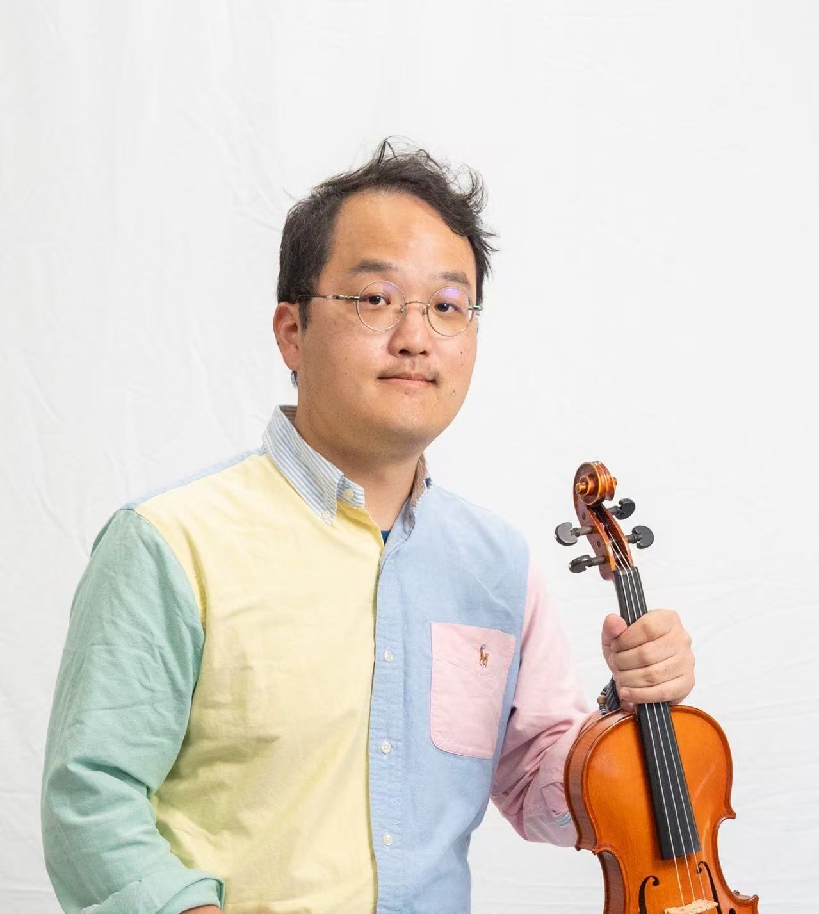
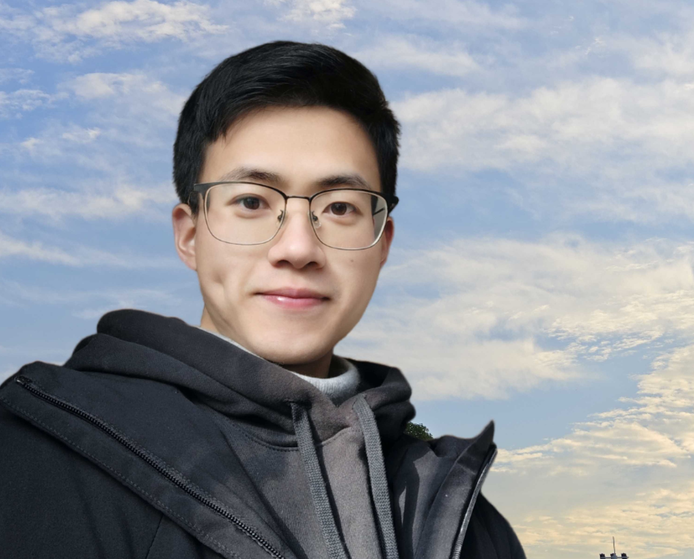
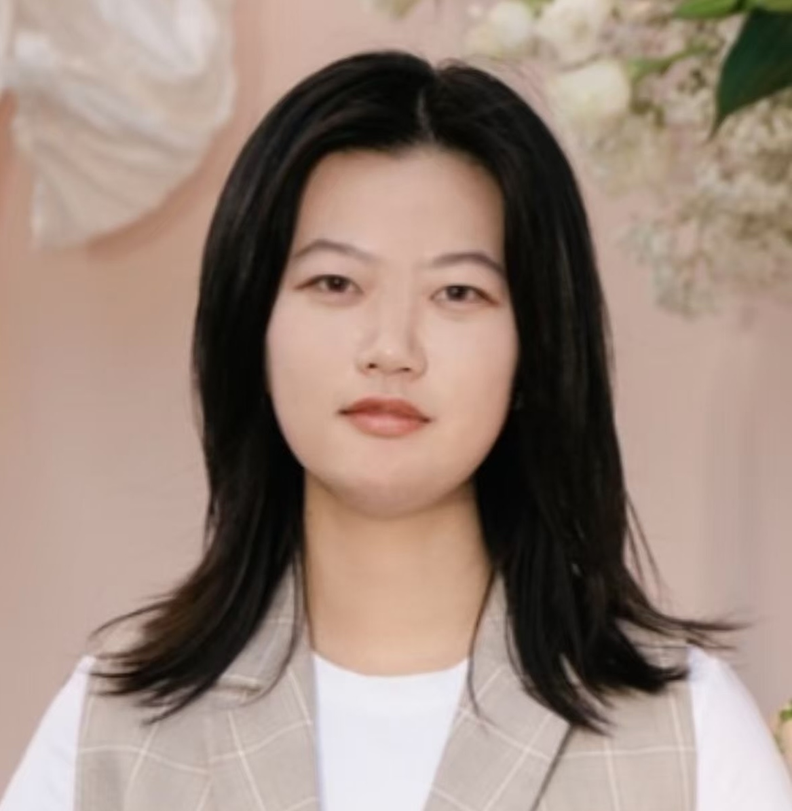
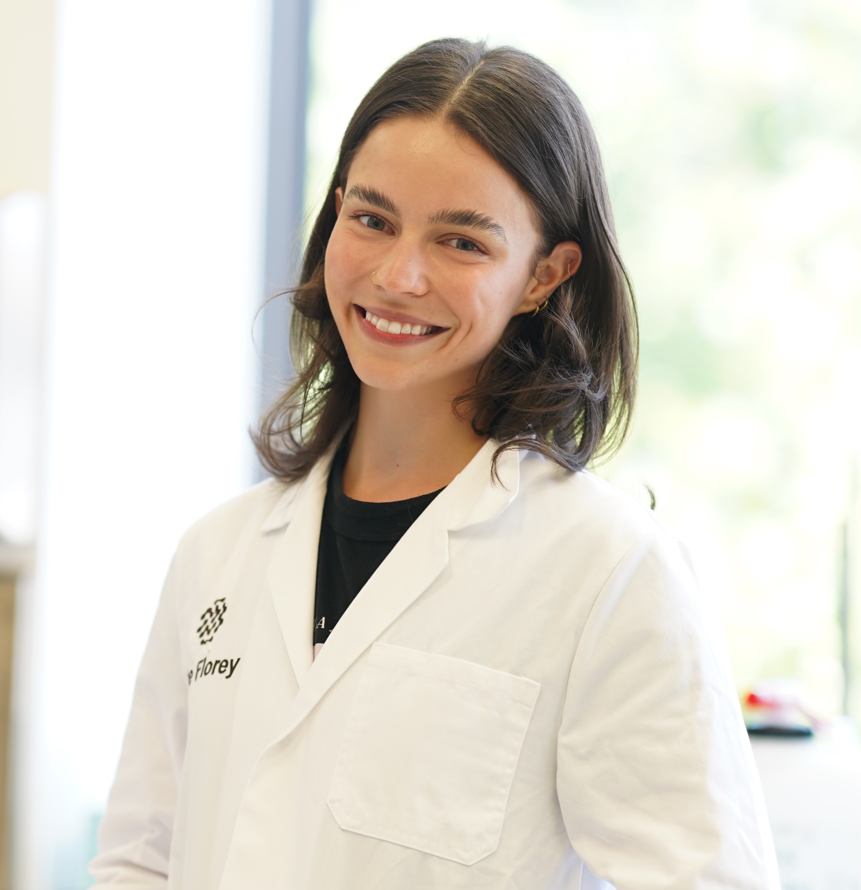
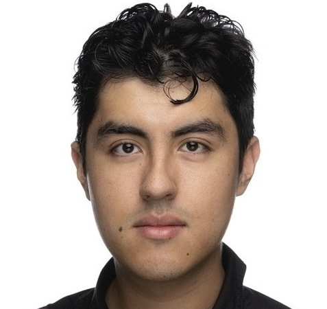
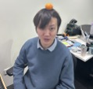
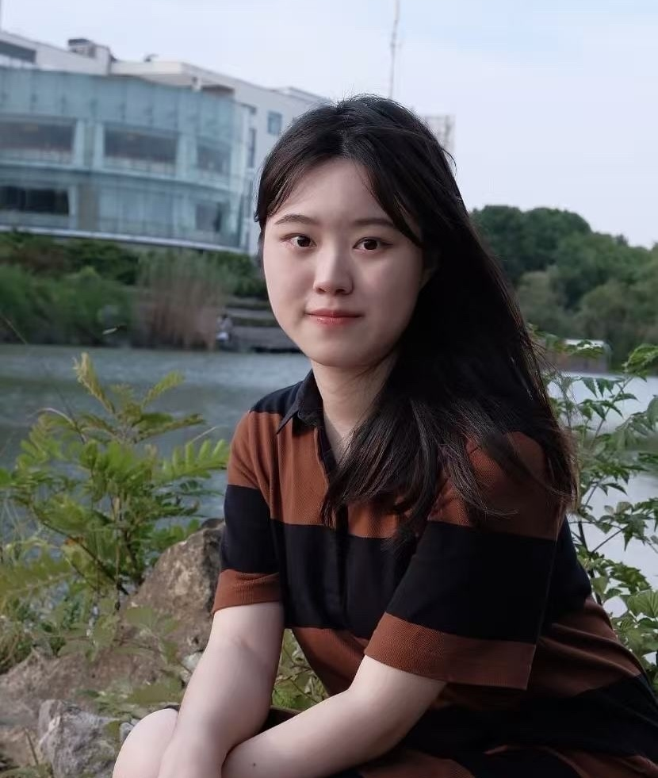

## Current Members (in chronological order)

::: {.people-grid}
::: {.person-card}
{fig-alt="Jiadong Mao" .person-card-photo}

#### Jiadong Mao

Statistician.

[GitHub](https://github.com/jiadongm) | [LinkedIn](https://www.linkedin.com/in/jiadong-mao-55b30091/) | [Email](mailto:chiatungmao@gmail.com)
:::

::: {.person-card}
{fig-alt="Xiaochen Zhang" .person-card-photo}

#### Xiaochen Zhang

PhD student, principal supervisor by Kim-Anh Lê Cao. Research: .
:::

::: {.person-card}
{fig-alt="Chengyi Ma" .person-card-photo}

#### Chengyi Ma

PhD student, principal supervisor by Kim-Anh Lê Cao. Research:
:::

::: {.person-card}
{fig-alt="Yifan Qin" .person-card-photo}

#### Yifan Qin

PhD student, principal supervisor by Kim-Anh Lê Cao. Research:
:::

::: {.person-card}
{fig-alt="Yinuo Sun" .person-card-photo}

#### Yinuo Sun

Research assistant. Research:
:::

::: {.person-card}
::: {.person-placeholder}
Photo pending
:::

#### Di Mu

PhD student, principal supervisor Shuai Li (UniMelb Public Health). Research: .
:::

::: {.person-card}
::: {.person-placeholder}
{fig-alt="Lauren Ursich" .person-card-photo}
:::

#### Lauren Ursich

PhD student, principal supervisor Leigh Walker (Florey Institute). Research: 
:::

::: {.person-card}
::: {.person-placeholder}
Photo pending
:::

#### Jonathan Salazar

MSc Bioinformatics student. Research:
:::

::: {.person-card}
::: {.person-placeholder}
Photo pending
:::

#### Lachlan Rowles

MSc Mathematics and Statistics student, principal supervisor Kim-Anh Lê Cao. Research:
:::

::: {.person-card}
{fig-alt="Efra Marin Peralta" .person-card-photo}

#### Alejandro Efraín (Efra) Marín Peralta

PhD student, principal supervisor Kim-Anh Lê Cao. Funded by the Leuven-Melbourne joint PhD program. 
Research: spatial metabolomics, transcriptomics and multiomics integration.
:::

:::

## Alumni

::: {.people-grid}
::: {.person-card}
{fig-alt="Yidi Deng" .person-card-photo}

#### Dr Yidi Deng

Completed PhD (principal supervisor Kim-Anh Lê Cao), now postdoc at Florey Institute.
:::

::: {.person-card}
{fig-alt="Hongyu Zhao" .person-card-photo}

#### Hongyu Zhao

Completed MSc in Data Science (principal supervisor Kim-Anh Lê Cao). Now secondary mathematics teacher in China.
:::

::: {.person-card}
::: {.person-placeholder}
Photo pending
:::

#### Hongling Liu

Completed MSc in Mathematics and Statistics (co-supervisor Aurore Delaigle).
:::

:::

